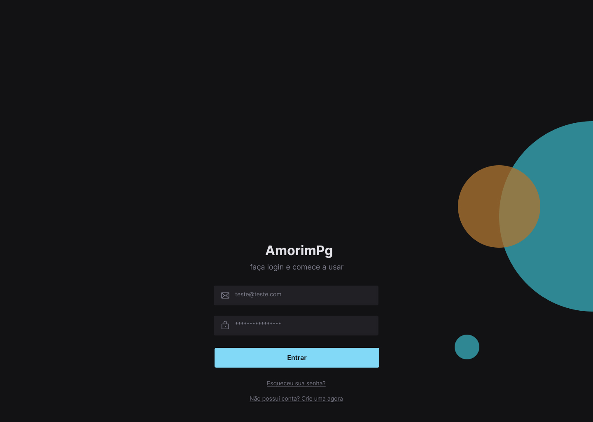

# Registro_Login

### Sobre

<p align="center"> O sistema tem o intuito de registra um usuário ao acessar uma interface do sistema e armazenar os dados. Assim, quando o usuário for fazer o login no sistema, sera possível acessar toda aplicação </p>


<hr>
<h4 align = "center">
 👷‍♂️Projeto 🚧 Registro_Login em contrução 🚧 ...
</h4>
<hr>

### Desafios

<div>

- No back end o sistema utilizar uma API Rest para fazer o envio dos dados que o front end precisar. A comunicação entre o sistema é utilizado o JSON.
- Os dados são criptografados e validados utilizando o bcrypt e o jwt. 
- A API Rest possui uma proteção das rotas pelo back end
- Para o armazenamento dos dados é mongodb

- No front end o sistema utiliza o react.js para dá estilo as paginas 
- Para a proteger as rotas pelo front end, navegar entre as páginas é utilizado o react-router-dom. 
- O front end interpreta os dados recebidos da API Rest 

</div>

<br>

<hr>
  <p align="center">
    <a href ="#sobre">Sobre</a> -
    <a href ="#desafios">Desafios</a> -
    <a href ="#features">Features</a> -
    <a href ="#ilustração">Ilustração</a> - 
    <a href ="#pré-requisitos">Pré-requisitos</a> -
    <a href ="#tecnologias_framework">Tecnologias/framework</a> -
    <a href ="#autor">Autor</a>
  </p>
<hr>

<br>

<br>

### Features 

- [x] Registra usuário 
- [x] LogIn usuário
- [x] Esqueceu a senha
- [x] Armazenar token
- [x] Manter o usuário autenticação com o back end (user)
- [x] Recuperar conta
- [x] LogOut
- [ ] Autenticação com o Google

### Ilustração

<div align= "center">
  
  
  
  <div>
    <a href="https://www.figma.com/file/EvvFIBsGZcCgs1ZPj9nEmi/Untitled?t=9MO9mqwKkCKUwc1a-6">Layout do projeto no figma</a>
  </div>
</div>


### Pré-requisitos

Antes de começar, você vai precisar ter instalado em sua máquina as seguintes ferramentas:
[Git](https://git-scm.com), [Node.js](https://nodejs.org/en/) e o [Mongo db compass](https://www.mongodb.com/try/download/compass). Para receber as mensagem de teste para recuperação da conta, sera usado [Mailtrap](https://mailtrap.io/). Além disto é bom ter um editor para trabalhar com o código como [VScode](https://code.visualstudio.com/)


### ⚙️ Rodando o sistema

```bash
#Clone este repositório
$ git clone <https://github.com/fabioamorim25/Registro_Login.git>

#Acesse a pasta do projeto no terminal/cmd
$ cd Registro_Login

  #INSTALAR BACK END

#Acesse a pasta do projeto no terminal/cmd
$ cd server
# Instale as deprendências
$ npm install
#Ir no arquivo [server/config/mail.json] e colocar os valores do seu mailtrap [Host, Port, User, Pass].

# Execute a aplicação em modo de desenvolvimento
$ npm start
#O servidor iniciará na porta:5000 - acesse <http://localhost:5000>


#Retornar para pasta raiz Registro_Login
$ cd ..


  #INSTALAR FRONT END

#Acesse a pasta do projeto no terminal/cmd
$ cd client
# Instale as deprendências
$ npm install
# Execute a aplicação em modo de desenvolvimento
$ npm start
#O cliente iniciará na porta:3000 - acesse <http://localhost:3000/login>
```

### 🛠️Tecnologias_framework

As seguintes ferramentas foram usadas na construção do projeto:

#### Front end
- [React.js](https://pt-br.reactjs.org/)
- [Axios](https://axios-http.com/docs/intro)

#### Back end
- [Node.js](https://nodejs.org/en/)
- [Express js](https://expressjs.com/pt-br/)
- [Mongo db](https://www.mongodb.com/pt-br/what-is-mongodb)
- [Mongoose](https://mongoosejs.com/)
- [Nodemailer](https://nodemailer.com/about/)


### Autor

[Fábio Amorim](https://linkedin.com/in/fabio-amorim-4545011a1) 😊
